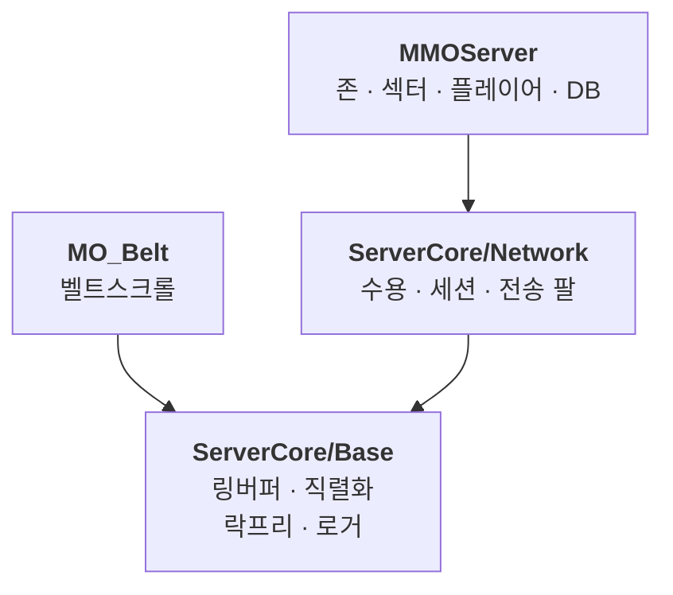

# MMO Game Server

[](https://cocoz93.github.io/portfolio/)

**Windows IOCP 기반 C++ MMO 게임서버** — 동접 **200 → ~5,000**까지 병목을 단계별로 추적·해소한 개인 성능 R&D 프로젝트입니다.
모든 최적화는 추측이 아니라 **A/B 실측**(Prometheus·Grafana 계측)으로 검증했습니다.
<sub>※ 200은 2PC·WAN, 5,000은 단일 PC 루프백 — 이어 붙여 비교하는 절대치가 아니라 구간별 병목 해소 기록입니다.</sub>

## 🔗 링크
- 🌐 **WEB PROFILE** — https://cocoz93.github.io/portfolio/
- 🍀 **기술경력서** — [Notion 바로가기](https://feline-vacation-d6d.notion.site/23316a0b9f59809db2e5d610a23a10a5?source=copy_link)
- 📚 **DEV LOG 26** — [노션 블로그 전체](https://feline-vacation-d6d.notion.site/DEV-LOG-26-2db16a0b9f598196a471d53775ab4223?source=copy_link)
- 🔒 **LockFree** — [락프리 큐·스택 + 2계층 메모리풀](https://github.com/cocoz93/LockFree) · 경합 창을 µs로 벌려 결함을 재현하는 테스트 하네스 포함
- 🏭 **구조·병목 투어** — https://cocoz93.github.io/portfolio/mmo-site/
- 📧 **Email** — wndnwls7@gmail.com

## 🛠 기술 스택
C++17 · Windows IOCP · Registered I/O · WinSock · MySQL · Prometheus · Grafana

## 📂 구조
| 폴더 | 설명 |
|------|------|
| `ServerCore/Base/` | 토대 계층 — 링버퍼·직렬화·락프리 설정·코어 친화도·로거·플랫폼 경계 |
| `ServerCore/Network/` | 전송 계층 — 수용·세션·전송 팔(IOCP / RIO / epoll). 게임 로직을 모른다 |
| `MMOServer/` | 게임 계층 — 존·섹터·플레이어·DB 워커 |
| `StressTest/` | 부하 하네스 + **전송 무결성 오라클** |
| `RIO/` | Registered I/O 전환 실험 — 게이트 스모크 · IOCP↔RIO A/B |
| `GameClient/` | 콘솔 클라이언트 |
| `WebClient/` | 브라우저 클라이언트 — **서버 무수정**, WS↔TCP 릴레이 |
| `Monitoring/` | 계측 설정 + A/B 수집·비교 스크립트 |
| `Shared/` · `Run/` | 서버·클라가 함께 쓰는 와이어 규약 · 실행 스크립트 |
| `img/` | 성능 실험 인포그래픽 **소스** (완성본은 위 투어·노션에서) |

## 🧩 서버 코어 분리

`ServerCore/` 와 `LockFree/` 는 폴더가 아니라 **별도 저장소**입니다 — 이 리포가 담는 건 커밋 해시 한 줄입니다.



같은 `RingBuffer.h` 사본 세 벌이 조용히 갈라진 뒤로, **코어는 ServerCore 에서만 고칩니다.**
클론 뒤 `git submodule update --init` 한 번.

- 어떻게 나눴나 · 코어 고치는 법 — [ServerCore README](https://github.com/cocoz93/ServerCore)
- 서브모듈 · 서브트리 · 별도리포 비교 — [노션](https://feline-vacation-d6d.notion.site/3de16a0b9f5980ae96ceeed0dd5679a9)

## ✅ 검증
성능 수치와 별개로, **동작이 맞는지**는 아래로 확인합니다.

| 무엇을 | 어떻게 | 위치 |
|--------|--------|------|
| 전송 무결성 | 에코 응답 payload `memcmp` → 불일치 시 바이트 덤프 + FailFast | `StressTest/2. Custom_echo_stress/` |
| 회귀 스모크 | 바이트 정합 · **64KB 링버퍼 랩 통과** · graceful 종료 · 1,000클라 접속폭풍 | `RIO\echo-smoke.ps1` |
| 설계 가정 게이트 | 본구현 **전에** RIO 함수테이블 · REGISTERED_IO 상속 · CQ 도착 확인 | `RIO/Smoke/main.cpp` |
| 락프리 정확성 | 경합 창을 µs로 증폭해 확률적 결함 재현 | [LockFree 저장소](https://github.com/cocoz93/LockFree) |

<details>
<summary><b>⚙️ 빌드</b> — LockFree 저장소 + MySQL 8.0 (x64 전용)</summary>

### LockFree 저장소가 필요합니다

락프리 자료구조는 사본을 두지 않고 [**LockFree 저장소**](https://github.com/cocoz93/LockFree)를 **직접 참조**합니다.
사본을 뒀다가 양쪽이 갈라져 결함 수정이 서버에 반영되지 않은 적이 있어 없앴습니다.

기본값은 **나란히 둔 형제 폴더**입니다.

```
<부모폴더>/
├─ MMO/         ← 이 저장소
└─ LockFree/    ← https://github.com/cocoz93/LockFree
```

다른 자리에 뒀다면 CMake 에 알려주면 됩니다 — 경로는 소스가 아니라 빌드계가 갖고 있습니다.
아래 「CMake 로 빌드」의 **구성 명령에 `-DLOCKFREE_DIR=<LockFree_Test 경로>` 를 덧붙이세요.**

폴더가 없으면 **구성 단계에서** 멈춥니다(예전엔 컴파일까지 가서 `C1083` 이 났고 원인이 안 보였습니다).

```
CMake Error at CMakeLists.txt:31 (message):
  LockFree 저장소를 찾을 수 없습니다: C:/nonexistent/LockFree_Test

    git clone https://github.com/cocoz93/LockFree  (이 저장소와 나란히)
    또는 -DLOCKFREE_DIR=<LockFree_Test 경로>
```

### MySQL 8.0

`BuildConfig.h` 의 `USE_DB_WORKER` 가 **기본 1**이라 `libmysql` 이 필요합니다.
DB 없이 빌드하려면 그 값을 **0** 으로 바꾸세요.

### CMake 로 빌드

서버는 **CMake 가 정본**입니다. `.vcxproj` · `.sln` 은 CMake 가 만들어내는 생성물이라 손으로 고치지 마세요.

```
cmake -S . -B build-vs -G "Visual Studio 17 2022" -A x64
cmake --build build-vs --config Release
```

`Run/.IOCP_build.bat` 이 위 두 줄을 대신 해 줍니다(클라 3종은 아직 각자의 `.sln` 을 씁니다).
산출물은 `Run/bin/` 에 떨어지고, 실행 배치들이 거기를 봅니다.

- **cmake 3.28.3** — `winget install Kitware.CMake --version 3.28.3`. 리눅스(WSL Ubuntu 24.04) 기본값과 맞춘 버전입니다
- **x64 전용** — 128비트 CAS를 써서 Win32는 빌드되지 않습니다
- 리눅스는 `cmake -B build-linux -G Ninja -DCMAKE_CXX_COMPILER=g++-13` 후 `cmake --build build-linux`

</details>

<details>
<summary><b>▶️ 실행</b> — 스모크 · 부하+계측 · A/B 수집</summary>

산출물은 `Run/bin/` 에, 배치는 `Run/` 에 있습니다.

```
Run\0. simple_test.bat        서버 + 콘솔 클라이언트 (계측 없음)
Run\3. MMO_stress.bat         서버 · 부하 클라 · Prometheus · Grafana 일괄 기동
.\RIO\echo-smoke.ps1 -ExpectTransport IOCP     회귀 스모크 (전부 PASS면 exit 0)
```

| 주소 | 무엇 |
|------|------|
| http://localhost:3000 | Grafana 대시보드 (프로비저닝 완료 상태) |
| http://localhost:9091 | Prometheus UI |
| http://localhost:9090 | 서버가 직접 노출하는 원본 지표 |

동접·워커 수는 `Run/bin/MMOServerConfig.ini` 와 `Run/bin/MMOStressConfig.ini` 에서 바꿉니다.
부하 클라를 **다른 PC**에서 돌리려면 `3-1.`(서버) / `3-2.`(클라) 를 나눠 실행하고
서버 주소를 `Run/stress_client_ip.txt` 에 적으세요.

**A/B 실측** — 부하를 **5분 이상** 돌린 뒤 수집합니다(그 전엔 표본이 모자라 빈 결과).

```powershell
cd Monitoring
.\metrics-collect.ps1 -RunLabel A_baseline     # 변종마다 한 번
.\metrics-collect.ps1 -RunLabel B_variant
.\metrics-compare.ps1 -Baseline A_baseline -Variant B_variant
```

CSV는 `Monitoring/metrics_out/` 에, 비교는 Δ%와 판정을 함께 출력합니다.
지표 목록·집계식은 `Monitoring/queries.json` — 자세한 건 [Monitoring/README.md](Monitoring/README.md).
스윕 자동화는 `Run/wtk-sweep.ps1`(워커×송신워커) · `Run/clientcount-sweep.ps1`(동접 천장) ·
`Run/affinity-ab.ps1`(코어 격리) 에 있습니다.

</details>

## 📄 라이선스

코드는 MIT — [LICENSE](LICENSE)
`WebClient/assets/` 의 픽셀 스프라이트·타일은 [LPC](https://github.com/sanderfrenken/Universal-LPC-Spritesheet-Character-Generator) 기여자 저작물로 **CC-BY-SA** 입니다(재배포 시 같은 조건). 개별 크레딧은 [WebClient/README.md](WebClient/README.md).
